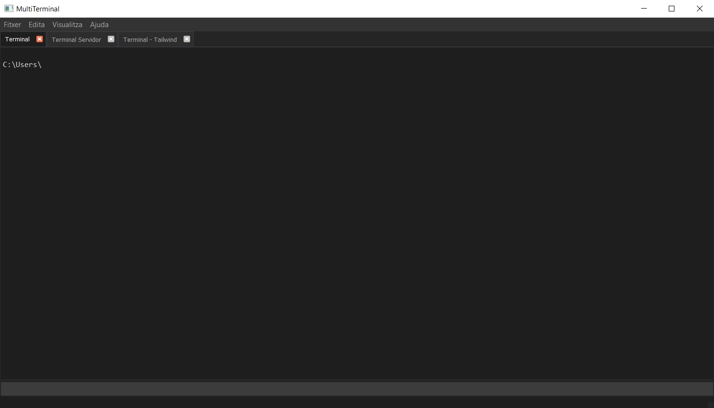

# MultiTerminal

MultiTerminal és una aplicació d'escriptori construïda amb Python i PyQt5 que permet gestionar múltiples terminals CMD en una única interfície amb pestanyes.



## Característiques

- **Múltiples terminals en pestanyes**: Gestiona diverses sessions de terminal simultàniament.
- **Layouts personalitzats**: Guarda i carrega configuracions de terminals.
- **Seguiment de processos**: Visualitza i finalitza processos en execució a cada terminal.
- **Historial de comandes**: Navega per comandes utilitzades prèviament amb les tecles de fletxa.
- **Temes personalitzables**: Configura colors, fonts i aparença.
- **Suport per a Ctrl+C**: Interrupció de processos en execució.
- **Carpetes de treball independents**: Cada terminal pot tenir el seu propi directori.
- **Comandes inicials**: Configura comandes a executar automàticament en iniciar un terminal.

## Instal·lació

### Opció 1: Descarregar l'executable (Windows)

1. Descarrega l'última versió de l'instal·lador des de la [pàgina de Releases](https://github.com/YOUR_USERNAME/multiterminal/releases).
2. Executa l'instal·lador i segueix les instruccions.

### Opció 2: Executar des del codi font

#### Prerequisits

- Python 3.8 o superior
- PyQt5
- Altres dependències (ansi2html)

#### Les dependències que tinc instal·lades (sols per caràcter informatiu)

altgraph==0.17.4
ansi2html==1.9.2
packaging==24.2
pefile==2023.2.7
pyinstaller==6.12.0
pyinstaller-hooks-contrib==2025.2
PyQt5==5.15.11
PyQt5-Qt5==5.15.2
PyQt5_sip==12.17.0
pywin32-ctypes==0.2.3
setuptools==78.1.0

#### Passos per instal·lar Python i les dependències

1. **Instal·lar Python**:
   - Descarrega i instal·la la última versió de Python des de [python.org](https://www.python.org/downloads/)
   - Durant la instal·lació, assegura't de marcar l'opció "Add Python to PATH"

2. **Instal·lar les dependències**:
   - Obre una finestra de terminal (CMD o PowerShell)
   - Executa les següents comandes:
   ```bash
   pip install PyQt5==5.15.11
   pip install ansi2html==1.9.2
   ```

3. **Clonar el repositori**:
   ```bash
   git clone https://github.com/qmrcat/multiterminal.git
   cd multiterminal
   ```

4. **Executar l'aplicació**:
   ```bash
   python main.py
   ```

## Ús de l'aplicació

### Creació de terminals

- Clica a `Fitxer > Nou Terminal` o prem `Ctrl+T` per afegir un nou terminal.
- Pots canviar el nom de la pestanya fent doble clic sobre ella.

### Gestió de layouts

- Per guardar l'estat actual dels terminals: `Fitxer > Guardar Layout`
- Per carregar un layout prèviament guardat: `Fitxer > Carregar Layout`
- Els layouts es guarden en format JSON a `%APPDATA%\MultiTerminal\layouts`

### Visualització de processos

- Per veure els processos en execució: `Visualitza > Veure Processos`
- Per finalitzar un procés, selecciona'l a la llista i clica a "Finalitza Procés"

### Personalització

- Accedeix a la configuració des de `Fitxer > Configuració`
- Pots canviar la font, colors, shell per defecte i altres opcions

### Dreceres de teclat

- `Ctrl+T`: Nou terminal
- `Ctrl+S`: Guardar layout
- `Ctrl+L`: Carregar layout
- `Ctrl+Shift+S`: Guardar layout com...
- `Ctrl+Q`: Sortir
- `Ctrl+C`: (En terminal) Interrompre procés en execució

## Generació d'un executable

Per crear un executable de l'aplicació, segueix aquests passos:

1. **Instal·lar PyInstaller**:
   ```bash
   pip install pyinstaller
   ```

2. **Generar l'executable**:
   - Crea un fitxer `multiterminal.spec` amb el contingut proporcionat a la secció "Distribució"
   - Executa:
   ```bash
   pyinstaller multiterminal.spec
   ```

3. **Crear un instal·lador (opcional)**:
   - Descarrega i instal·la [Inno Setup](https://jrsoftware.org/isdl.php)
   - Utilitza l'script proporcionat a la secció "Distribució" per generar un instal·lador
   - Troba l'instal·lador a la carpeta `installer`

## Desenvolupament

### Estructura del projecte

```
multiterminal/
  ├── main.py             # Punt d'entrada
  ├── main_window.py      # Finestra principal i gestió de pestanyes
  ├── terminal_widget.py  # Widget de terminal i comunicació amb QProcess
  ├── command_line_edit.py # Entrada de comandes amb historial
  ├── settings_dialog.py  # Diàleg de configuració
  ├── process_viewer_dialog.py # Visualitzador de processos
  ├── config.py           # Configuració global
  ├── utils.py            # Funcions d'utilitat
  └── themes/             # Fitxers de temes (.qss)
```

### Contribucions

Les contribucions són benvingudes! Si vols contribuir al projecte:

1. Fes un fork del repositori
2. Crea una branca per a la teva característica (`git checkout -b feature/amazing-feature`)
3. Fes commit dels teus canvis (`git commit -m 'Add amazing feature'`)
4. Puja la branca (`git push origin feature/amazing-feature`)
5. Obre un Pull Request

## Problemes coneguts

- En alguns casos, la interrupció de processos (Ctrl+C) pot no funcionar amb tots els processos.
- La codificació pot variar depenent de la configuració regional del sistema.

## Llicència

Aquest projecte està llicenciat sota la llicència MIT - vegeu el fitxer [LICENSE.md](LICENSE.md) per a més detalls.

## Agraïments

- PyQt5 per proporcionar la base de la interfície gràfica
- Tots els contribuïdors i usuaris que han ajudat a millorar l'aplicació
- A Gogle AI Studio i sobretot a Claude 3.7 Sonnet i en menor mesura a ChatGPT 4o i a Mistral
